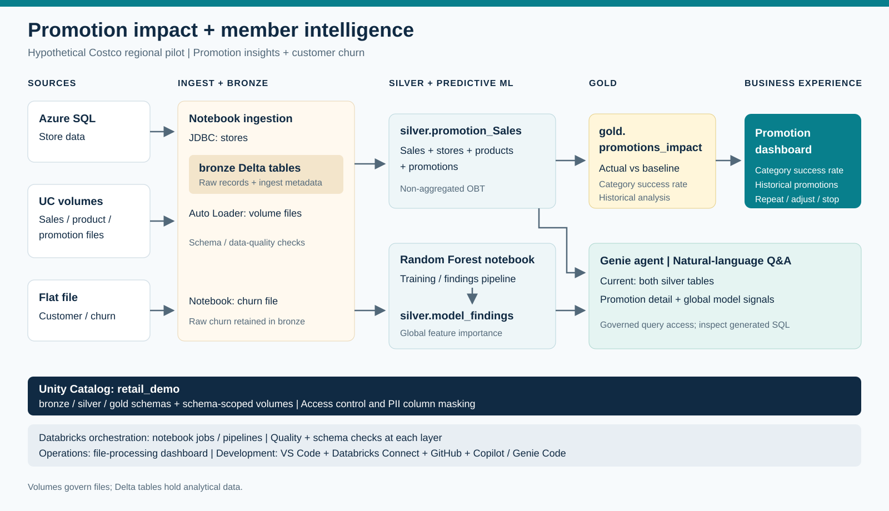

# Retail Campaign Spend ROI and Customer Churn

An end-to-end Databricks retail intelligence prototype that combines promotion-performance analytics, campaign spend ROI, operational ingestion monitoring, customer churn modeling, and Unity Catalog governance.

The project uses a Bronze-Silver-Gold medallion architecture:

- **Bronze** ingests sales, product, promotion, and store data into Delta tables.
- **Silver** enriches sales with product, store, and promotion details.
- **Gold** calculates promotion investment, incremental performance, uplift, and effectiveness.
- **Dashboards** expose promotion results and Auto Loader processing status.
- **Machine learning** trains and tracks a customer churn model with MLflow.
- **Unity Catalog** provides discoverability, lineage, tags, and column-level masking.

> This repository is a hypothetical Costco regional retail-intelligence prototype. It is intended for demonstrations and learning, not as an official Costco system or production deployment.



## Table of Contents

- [What the Project Answers](#what-the-project-answers)
- [Architecture and Data Flow](#architecture-and-data-flow)
- [Repository Structure](#repository-structure)
- [Data Model](#data-model)
- [Promotion Metric Definitions](#promotion-metric-definitions)
- [Prerequisites](#prerequisites)
- [Quick Start](#quick-start)
- [Detailed Execution Guide](#detailed-execution-guide)
- [Reprocessing and Incremental Behavior](#reprocessing-and-incremental-behavior)
- [Dashboards](#dashboards)
- [Customer Churn Model](#customer-churn-model)
- [Unity Catalog Governance Demo](#unity-catalog-governance-demo)
- [Validation Queries](#validation-queries)
- [Operational Notes](#operational-notes)
- [Known Assumptions and Input Contracts](#known-assumptions-and-input-contracts)
- [Troubleshooting](#troubleshooting)

## What the Project Answers

The promotion pipeline is designed to answer questions such as:

- How much was invested in each promotion through discounts?
- Did a promotion increase revenue or units compared with the product baseline?
- What incremental revenue and gross profit did a promotion generate?
- Which promotions should be repeated, adjusted, or stopped?
- How are sales and units trending by month and product?
- Which source files have been discovered and processed by Auto Loader?

The churn workflow answers a separate set of customer-retention questions:

- Which customer attributes are most predictive of churn?
- How accurately can a Random Forest model identify churners?
- Which customers have the highest predicted churn risk?
- Which global churn drivers should be available to Databricks Genie or other analytical consumers?

## Architecture and Data Flow

```text
                         Unity Catalog: retail_demo

 CSV files in a UC Volume                         Azure SQL
 sales / products / promotions                    store dimension
              |                                        |
              | Auto Loader                            | JDBC
              v                                        v
 +------------------------------------------------------------------+
 | Bronze                                                           |
 | retail_demo.bronze.sales                                         |
 | retail_demo.bronze.product                                       |
 | retail_demo.bronze.promotions                                    |
 | retail_demo.bronze.store                                         |
 +------------------------------------------------------------------+
                              |
                              | enrich, validate, deduplicate, merge
                              v
 +------------------------------------------------------------------+
 | Silver                                                           |
 | retail_demo.silver.promotion_sales                               |
 | one row per sale_id + sale_date                                  |
 +------------------------------------------------------------------+
                              |
                              | aggregate promotion vs. baseline
                              v
 +------------------------------------------------------------------+
 | Gold                                                             |
 | retail_demo.gold.promotion_impact                                |
 | one row per product_id + promotion_id                            |
 +------------------------------------------------------------------+
                 |                                |
                 v                                v
       Promotion dashboard              Databricks Genie / SQL
```

A parallel machine-learning workflow reads customer churn data from `bronze_churn`, trains a Random Forest classifier, logs the run to MLflow, writes the ten most important features to `retail_demo.silver.model_findings`, and scores a sample of customers.

### Processing sequence

1. Create the `retail_demo` catalog, medallion schemas, and raw-data volume.
2. Upload sales, product, and promotion CSV files to the volume.
3. Ingest those files into Bronze Delta tables with Databricks Auto Loader.
4. Read store data from Azure SQL and merge it into the Bronze store table.
5. Stream new Bronze sales into the enriched Silver table.
6. aggregate Silver data into promotion-level Gold metrics.
7. Query the Gold and Silver tables through Databricks SQL dashboards.
8. Optionally run the churn and Unity Catalog governance notebooks.

## Repository Structure

```text
roi_campaign_spends/
|-- Data/
|   `-- csv/
|       |-- churn/churn.csv
|       |-- product/product.csv
|       |-- promotions/promotions.csv
|       `-- sales/sales.csv
|-- Dashboards/
|   |-- Auto Loader Files Processed - Sales, Promotions & Products.lvdash.json
|   `-- promotion effectiveness.lvdash.json
|-- ML_Churn/
|   `-- Churn Risk Prediction.ipynb
|-- src/
|   |-- bronze/
|   |   |-- load_product.py
|   |   |-- load_promotions.py
|   |   |-- load_sales.py
|   |   `-- load_store.py
|   |-- silver/
|   |   `-- load_promotion_sales.py
|   |-- gold/
|   |   `-- load_promotion_impact.py
|   |-- create_unity_catalog.py
|   `-- Unity Catalog Demo - Retail.ipynb
|-- Costco-Architecture.svg
|-- Costco-Retail-Intelligence-With-Databricks-Features.pptx
|-- databricks.yml
`-- README.md
```

### Main assets

| Asset | Purpose |
|---|---|
| `src/create_unity_catalog.py` | Creates the catalog, Bronze/Silver/Gold schemas, and raw-data volume. |
| `src/bronze/load_sales.py` | Incrementally ingests sales CSV files with Auto Loader. |
| `src/bronze/load_product.py` | Incrementally ingests product CSV files with Auto Loader. |
| `src/bronze/load_promotions.py` | Incrementally ingests promotion CSV files with Auto Loader. |
| `src/bronze/load_store.py` | Reads store data from Azure SQL through JDBC and merges changes into Delta. |
| `src/silver/load_promotion_sales.py` | Enriches sales and maintains the sale-level analytical table. |
| `src/gold/load_promotion_impact.py` | Builds synchronized product-promotion ROI and uplift metrics. |
| `Dashboards/*.lvdash.json` | Serialized Databricks AI/BI dashboard definitions. |
| `ML_Churn/Churn Risk Prediction.ipynb` | Trains, tracks, explains, and uses the churn model. |
| `src/Unity Catalog Demo - Retail.ipynb` | Demonstrates comments, tags, masks, discovery, and lineage. |
| `Costco-Architecture.svg` | Visual architecture included at the top of this README. |
| `Costco-Retail-Intelligence-With-Databricks-Features.pptx` | Presentation describing the solution and Databricks features. |
| `databricks.yml` | Databricks Asset Bundle identity and development workspace target. |

## Data Model

### Bronze layer

Bronze preserves source-level records and adds operational metadata where applicable.

#### `retail_demo.bronze.sales`

Created by `src/bronze/load_sales.py`.

Required downstream fields:

| Column | Meaning |
|---|---|
| `sale_id` | Stable sale identifier used by the Silver merge. |
| `sale_date` | Date of the sale. |
| `store_id` | Store identifier. |
| `product_id` | Product identifier. |
| `units_sold` | Number of units sold. |
| `revenue` | Revenue after discounts. |
| `_source_file_name` | Name of the file processed by Auto Loader. |
| `_ingested_at` | Bronze ingestion timestamp. |

Auto Loader allows new columns to be added through schema evolution and writes inferred schema and checkpoint state to the Unity Catalog volume.

#### `retail_demo.bronze.product`

Created by `src/bronze/load_product.py`.

| Required column | Meaning |
|---|---|
| `product_id` | Product identifier. |
| `product_name` | Product display name. |
| `category` | Product category. |
| `regular_price` | Standard price before promotion. |
| `gross_margin_pct` | Gross margin as percentage points from 0 to 100. |

The table also contains source path, file name, file size, file modification time, and ingestion timestamp metadata.

#### `retail_demo.bronze.promotions`

Created by `src/bronze/load_promotions.py`.

| Required column | Meaning |
|---|---|
| `promotion_id` | Promotion identifier. |
| `product_id` | Product receiving the promotion. |
| `promotion_name` | Promotion display name. |
| `discount_pct` | Discount as percentage points from 0 to 100. |
| `start_date` | First date on which the promotion applies. |
| `end_date` | Last date on which the promotion applies. |

The promotion is matched to a sale when the product IDs are equal and the sale date falls between the promotion start and end dates, inclusive.

#### `retail_demo.bronze.store`

Created by `src/bronze/load_store.py` from an Azure SQL table.

| Required column | Meaning |
|---|---|
| `store_id` | Unique, non-null key used by the Delta merge. |
| `store_name` | Store display name. |
| `store_location` | Store location. |
| `store_zip` | Store postal code. |
| `_created_at` | Time the Bronze row was first inserted. |
| `_updated_at` | Time the Bronze row was last merged. |

The notebook validates that the configured ID column exists, is non-null, and is unique in the source before merging.

### Silver layer

#### `retail_demo.silver.promotion_sales`

Created by `src/silver/load_promotion_sales.py`.

**Grain:** one row per `sale_id` and `sale_date`.

The table:

- starts from the Bronze sales stream;
- keeps the latest sale, product, promotion, and store record per key;
- enriches each sale with store, product, and active promotion attributes;
- classifies rows as `Promotion` or `Baseline`;
- calculates the absolute `discount_amount`;
- rejects null sale keys;
- rejects duplicate sale/date results, including duplicates caused by overlapping promotions;
- uses a Delta `MERGE` so rerunning the same sale updates rather than duplicates it.

The discount calculation is:

```text
discount_amount = (regular_price * units_sold) - revenue
```

### Gold layer

#### `retail_demo.gold.promotion_impact`

Created by `src/gold/load_promotion_impact.py`.

**Grain:** one row per `product_id` and `promotion_id`.

The Gold table aggregates all baseline rows for a product and compares that baseline with each promotion for the same product. The table is fully synchronized on every run:

- matching promotions are updated;
- new promotions are inserted;
- promotions no longer present in Silver are deleted;
- the table is recreated if its schema differs from the current transformation output.

Key outputs include:

- promotion and baseline units;
- promotion and baseline revenue;
- promotion investment;
- net selling price;
- incremental units, revenue, and gross profit;
- unit and revenue uplift percentages;
- promotion effectiveness classification.

## Promotion Metric Definitions

| Metric | Definition |
|---|---|
| `baseline_units` | Sum of units from all Silver rows classified as `Baseline` for the product. |
| `baseline_revenue` | Sum of revenue from all baseline rows for the product. |
| `promotion_units` | Sum of units for the product and promotion. |
| `promotion_revenue` | Sum of revenue for the product and promotion. |
| `promotion_investment` | Sum of sale-level discount amounts for the promotion. |
| `incremental_units` | `promotion_units - baseline_units` |
| `net_selling_price` | `promotion_revenue / promotion_units`; null when promotion units are zero. |
| `incremental_revenue` | `incremental_units * net_selling_price` |
| `incremental_gross_profit` | `incremental_revenue * ((gross_margin_pct - discount_pct) / 100)` |
| `revenue_uplift_pct` | `((promotion_revenue - baseline_revenue) / baseline_revenue) * 100`; null when baseline revenue is zero. |
| `unit_uplift_pct` | `((promotion_units - baseline_units) / baseline_units) * 100`; null when baseline units are zero. |

Promotion effectiveness is classified from the unrounded revenue uplift:

| Classification | Rule |
|---|---|
| `HIGH` | Revenue uplift is at least 20%. |
| `MEDIUM` | Revenue uplift is greater than 0% but less than 20%. |
| `LOW` | Revenue uplift is 0%, negative, or undefined. |

Percentage fields are stored as whole percentage points. For example, `10` means 10%, not `0.10`.

## Prerequisites

### Databricks

- A Databricks workspace with Unity Catalog enabled.
- Permission to create a catalog, schemas, volumes, tables, and functions.
- A cluster or serverless notebook environment that supports:
  - Delta Lake;
  - Structured Streaming;
  - Databricks Auto Loader;
  - Unity Catalog volumes;
  - PySpark;
  - scikit-learn, pandas, and MLflow for the churn notebook.
- A Databricks SQL warehouse for the dashboards.
- Access to the Microsoft SQL Server JDBC driver for store ingestion.

### Local tooling

- Git.
- VS Code with the Databricks extension, or the Databricks workspace UI.
- Databricks CLI authentication if using Asset Bundle or CLI-based upload workflows.

The default development target in `databricks.yml` points to:

```text
https://dbc-65eff1da-e74c.cloud.databricks.com
```

Change the workspace host before using the bundle in a different workspace.

### Azure SQL for stores

The store notebook needs:

- SQL server hostname;
- database name;
- source table name;
- ID column name;
- SQL username;
- SQL password;
- network access from Databricks to Azure SQL.

Do not commit credentials to this repository. Supply them at run time, or adapt the notebook to resolve credentials from a Databricks secret scope.

## Quick Start

### 1. Clone the repository

```powershell
git clone https://github.com/saibharathparsam/roi_campaign_spends.git
Set-Location roi_campaign_spends
```

### 2. Configure the Databricks workspace

Update the `workspace.host` value in `databricks.yml` if the project will run in a different workspace.

If using Databricks Asset Bundles, authenticate and validate connectivity:

```powershell
databricks auth login --host https://<your-workspace-host>
databricks bundle validate -t dev
```

The current bundle file identifies the project and workspace target. It does not define jobs or task resources, so notebooks/scripts must be run manually or added to a workflow.

### 3. Create Unity Catalog objects

Run `src/create_unity_catalog.py` on Databricks. It creates:

```text
retail_demo
|-- bronze
|-- silver
|-- gold
`-- bronze.raw_data volume
```

All statements use `IF NOT EXISTS`, making this setup step safe to rerun.

### 4. Upload source files

Copy CSV files into these volume locations:

| Source | Required volume location |
|---|---|
| Sales | `/Volumes/retail_demo/bronze/raw_data/csv/sales/` |
| Products | `/Volumes/retail_demo/bronze/raw_data/csv/product/` |
| Promotions | `/Volumes/retail_demo/bronze/raw_data/csv/promotions/` |

The repository includes small example datasets under `Data/csv/`.

> Before using the included sales sample with the Silver pipeline, add a stable, unique `sale_id` column. See [Known Assumptions and Input Contracts](#known-assumptions-and-input-contracts).

### 5. Run the notebooks/scripts in order

Use this dependency order:

```text
create_unity_catalog.py
        |
        +--> load_sales.py ---------+
        +--> load_product.py -------+--> load_promotion_sales.py --> load_promotion_impact.py
        +--> load_promotions.py ----+
        +--> load_store.py ---------+
```

The three file-ingestion notebooks and the store notebook are independent of one another and may run in parallel after catalog setup. Silver must wait for all four Bronze tables. Gold must wait for Silver.

### 6. Validate the output

```sql
SELECT COUNT(*) FROM retail_demo.bronze.sales;
SELECT COUNT(*) FROM retail_demo.bronze.product;
SELECT COUNT(*) FROM retail_demo.bronze.promotions;
SELECT COUNT(*) FROM retail_demo.bronze.store;
SELECT COUNT(*) FROM retail_demo.silver.promotion_sales;
SELECT COUNT(*) FROM retail_demo.gold.promotion_impact;

SELECT *
FROM retail_demo.gold.promotion_impact
ORDER BY revenue_uplift_pct DESC;
```

### 7. Import the dashboards

Import the `.lvdash.json` definitions from `Dashboards/` into Databricks AI/BI Dashboards, connect them to a SQL warehouse, and verify that the configured tables and checkpoint locations are accessible.

## Detailed Execution Guide

### Step 1: Catalog and volume initialization

Run:

```text
src/create_unity_catalog.py
```

Created objects:

```sql
CREATE CATALOG IF NOT EXISTS retail_demo;
CREATE SCHEMA IF NOT EXISTS retail_demo.bronze;
CREATE SCHEMA IF NOT EXISTS retail_demo.silver;
CREATE SCHEMA IF NOT EXISTS retail_demo.gold;
CREATE VOLUME IF NOT EXISTS retail_demo.bronze.raw_data;
```

### Step 2: File ingestion with Auto Loader

Run:

```text
src/bronze/load_sales.py
src/bronze/load_product.py
src/bronze/load_promotions.py
```

Each notebook:

1. reads CSV files with headers;
2. infers column types;
3. persists the inferred schema;
4. allows additive schema evolution;
5. appends data to a Delta table;
6. uses an Auto Loader checkpoint to avoid processing the same file twice;
7. runs with `availableNow=True`, processes all available files, and stops.

This is scheduled batch behavior implemented with streaming semantics. It is suitable for a periodic Databricks Workflow task without leaving a continuously running stream.

### Step 3: Store ingestion from Azure SQL

Run:

```text
src/bronze/load_store.py
```

Set the notebook widgets:

| Widget | Example | Description |
|---|---|---|
| `sql_server` | `myserver.database.windows.net` | Azure SQL server hostname. |
| `sql_database` | `customer` | Database containing the store table. |
| `source_table` | `dbo.store` | JDBC source table. |
| `store_id_column` | `store_id` | Unique source key. |
| `sql_username` | supplied at run time | SQL login. |
| `sql_password` | supplied securely at run time | SQL password. |

The notebook performs a current-state merge:

- existing stores are updated;
- new stores are inserted;
- source rows are rejected if the key is null or duplicated;
- source deletions are not propagated to Bronze.

### Step 4: Silver enrichment

Run:

```text
src/silver/load_promotion_sales.py
```

The notebook validates all required source columns before creating or updating Silver. It then reads the Bronze sales table as a stream and handles each micro-batch with `foreachBatch`.

Joins:

```text
sales.store_id   = store.store_id
sales.product_id = product.product_id
sales.product_id = promotion.product_id
sales.sale_date BETWEEN promotion.start_date AND promotion.end_date
```

All joins are left joins, so a sale remains in Silver even when dimension data is missing. Missing promotion matches become `Baseline`.

### Step 5: Gold promotion analytics

Run:

```text
src/gold/load_promotion_impact.py
```

Before aggregation, the notebook:

- verifies the Silver schema;
- verifies that `discount_pct` and `gross_margin_pct` are between 0 and 100 when present;
- uses zero baseline values for promoted products with no baseline records;
- avoids division by zero by returning null for undefined ratios.

Gold is a fully derived current-state table. Unlike Bronze and Silver, it does not preserve rows for promotions removed from the source calculation.

## Reprocessing and Incremental Behavior

### Default mode: incremental

The Bronze Auto Loader and Silver notebooks expose an `is_reprocess` widget with a default value of `false`.

With `is_reprocess=false`:

- Auto Loader reads only files not already represented in its checkpoint;
- Bronze appends newly discovered file records;
- Silver processes newly committed Bronze sales and merges them by sale key;
- dimension tables are read at the time each Silver micro-batch runs;
- Gold recalculates from the complete Silver table.

### Full reprocessing

Set `is_reprocess=true` only when a complete rebuild is intended.

For Bronze file ingestion, this:

- drops the target table;
- deletes the source-specific Auto Loader checkpoint;
- deletes the stored inferred schema;
- rereads every file still present in the source directory.

For Silver, this:

- drops `retail_demo.silver.promotion_sales`;
- deletes its streaming checkpoint;
- rebuilds from all available Bronze sales commits.

Use reprocessing carefully. If the same logical records appear in multiple source files, Bronze will retain all of them. Silver deduplicates only at its defined sale key.

## Dashboards

### Promotion effectiveness dashboard

File:

```text
Dashboards/promotion effectiveness.lvdash.json
```

Data sources:

- `retail_demo.gold.promotion_impact`
- `retail_demo.silver.promotion_sales`

Included views:

- total promotion investment;
- revenue uplift by promotion;
- unit uplift by promotion;
- promotion effectiveness summary;
- total sales by month and product;
- units sold by month and product;
- monthly sales and unit detail;
- monthly revenue trend.

### Auto Loader processing dashboard

File:

```text
Dashboards/Auto Loader Files Processed - Sales, Promotions & Products.lvdash.json
```

The dashboard calls `cloud_files_state()` for the sales, promotions, and product checkpoints. It exposes:

- files processed by source;
- processing volume by day;
- latest processing and commit time per source;
- total files processed;
- ingestion-state breakdown;
- recent processed files;
- source and processed-time filters.

This dashboard depends on the checkpoint paths remaining unchanged.

## Customer Churn Model

Notebook:

```text
ML_Churn/Churn Risk Prediction.ipynb
```

### Expected input

The notebook reads:

```python
spark.table("bronze_churn")
```

Create this table or view in the notebook's active catalog/schema before running the workflow. The included `Data/csv/churn/churn.csv` contains 5,630 example records and the fields used by the model.

### Training workflow

1. Load `bronze_churn` into pandas.
2. Remove `CustomerID` from the feature set.
3. Identify categorical and numeric columns.
4. Impute numeric nulls with the median.
5. Impute categorical nulls with the most frequent value.
6. One-hot encode categorical variables, ignoring previously unseen categories.
7. Make a stratified 80/20 train/test split with random seed 42.
8. Train a `RandomForestClassifier` with:
   - `n_estimators=100`;
   - `random_state=42`;
   - `class_weight="balanced"`.
9. Log parameters, metrics, and the complete preprocessing/model pipeline to MLflow.
10. Calculate the ten most important model features.
11. Overwrite `retail_demo.silver.model_findings` with those global feature importances.
12. Load the run with the best logged ROC AUC and score ten randomly selected customers.

### Logged metrics

- accuracy;
- precision;
- recall;
- F1 score;
- ROC AUC;
- confusion matrix displayed in the notebook.

The notebook currently uses a user-specific MLflow experiment path. Change:

```text
/Users/saibharathparsam@outlook.com/churn_prediction
```

to a path available to the user running the notebook.

### Scoring output

The sample scoring cell returns:

- `CustomerID`;
- binary `predicted_churn`;
- `churn_risk_probability`;
- `risk_band`.

Risk bands are:

| Band | Probability |
|---|---|
| Low | 0.00 through 0.30 |
| Medium | Greater than 0.30 through 0.60 |
| High | Greater than 0.60 through 1.00 |

## Unity Catalog Governance Demo

Notebook:

```text
src/Unity Catalog Demo - Retail.ipynb
```

The notebook demonstrates:

- browsing the catalog/schema/table hierarchy;
- querying `information_schema`;
- adding descriptions to Silver and Gold columns;
- applying `pii` and `sensitive` column tags;
- creating SQL masking functions;
- masking customer names and email addresses for non-admin users;
- viewing Bronze-to-Silver-to-Gold lineage in Catalog Explorer.

The PII section assumes that `retail_demo.bronze.customer` already exists with:

- `Id`;
- `name`;
- `email`;
- `_created_at`;
- `_updated_at`.

It also assumes an account group named `retail_demo_admins`. Members see original values; other users see masked names and email addresses.

Review and adapt group names, privileges, and masking rules before using this pattern outside a demo environment.

## Validation Queries

### Confirm table availability

```sql
SHOW TABLES IN retail_demo.bronze;
SHOW TABLES IN retail_demo.silver;
SHOW TABLES IN retail_demo.gold;
```

### Find missing enrichment

```sql
SELECT
  SUM(CASE WHEN store_name IS NULL THEN 1 ELSE 0 END) AS missing_store,
  SUM(CASE WHEN product_name IS NULL THEN 1 ELSE 0 END) AS missing_product
FROM retail_demo.silver.promotion_sales;
```

### Confirm the Silver grain

```sql
SELECT sale_id, sale_date, COUNT(*) AS row_count
FROM retail_demo.silver.promotion_sales
GROUP BY sale_id, sale_date
HAVING COUNT(*) > 1;
```

The query should return no rows.

### Check promotion date overlaps

```sql
SELECT
  a.product_id,
  a.promotion_id AS promotion_a,
  b.promotion_id AS promotion_b,
  a.start_date,
  a.end_date,
  b.start_date,
  b.end_date
FROM retail_demo.bronze.promotions a
JOIN retail_demo.bronze.promotions b
  ON a.product_id = b.product_id
 AND a.promotion_id < b.promotion_id
 AND a.start_date <= b.end_date
 AND b.start_date <= a.end_date;
```

Overlapping promotions for the same product can make one sale match more than one promotion. The Silver notebook detects and rejects that result.

### Review promotion outcomes

```sql
SELECT
  promotion_name,
  product_name,
  promotion_investment,
  incremental_revenue,
  incremental_gross_profit,
  revenue_uplift_pct,
  unit_uplift_pct,
  promotion_effectiveness
FROM retail_demo.gold.promotion_impact
ORDER BY revenue_uplift_pct DESC NULLS LAST;
```

### Inspect Auto Loader state

```sql
SELECT *
FROM cloud_files_state(
  '/Volumes/retail_demo/bronze/raw_data/_autoloader/sales/checkpoint'
);
```

Replace `sales` with `product` or `promotions` to inspect the other sources.

## Operational Notes

### Idempotency

- Catalog initialization is idempotent through `IF NOT EXISTS`.
- Auto Loader checkpoints prevent normal reruns from reprocessing unchanged files.
- The Azure SQL store load uses a key-based Delta merge.
- Silver uses a key-based Delta merge at `sale_id + sale_date`.
- Gold synchronizes the complete current result at `product_id + promotion_id`.

### Data quality checks

The implementation fails explicitly when:

- a required source table column is missing;
- a sales micro-batch contains null `sale_id` or `sale_date`;
- overlapping promotion matches create multiple Silver rows for one sale/date;
- the configured store key is absent, null, or duplicated;
- percentages fall outside the 0-100 range.

### Schema evolution

- Bronze file tables accept additive columns through Auto Loader.
- Silver has an explicit selected schema and ignores unrelated Bronze fields.
- Gold compares target and source columns and recreates the target when the schemas differ.

### Scheduling

The repository does not currently define Databricks Workflow resources in `databricks.yml`. For scheduled execution, create a job with these dependencies:

```text
setup
  -> [bronze_sales, bronze_product, bronze_promotions, bronze_store]
  -> silver_promotion_sales
  -> gold_promotion_impact
```

The setup task may be retained for idempotent environment checks or run only during deployment.

## Known Assumptions and Input Contracts

1. **Sales need a stable key.**
   `src/silver/load_promotion_sales.py` requires `sale_id`, but the included `Data/csv/sales/sales.csv` sample does not currently contain that column. Add a deterministic, unique `sale_id` before running Silver. Do not use a randomly regenerated ID if files may be reprocessed.

2. **Promotion periods should not overlap for the same product.**
   A sale may otherwise match multiple promotions. Silver detects the duplicate output and stops rather than writing ambiguous data.

3. **Baseline is product-level and aggregated across all baseline rows.**
   Gold compares every promotion for a product with the same total product baseline. It does not currently normalize for promotion duration, store count, seasonality, or matching calendar periods.

4. **Percentage columns use 0-100 values.**
   A 10% discount must be stored as `10`, not `0.10`.

5. **The store source is a current snapshot.**
   The Bronze merge inserts and updates stores but does not delete target stores absent from Azure SQL.

6. **Churn input creation is external to the notebook.**
   The churn notebook expects `bronze_churn`; this repository includes the source CSV but does not include a dedicated ingestion script for that table.

7. **The governance customer table is external to this pipeline.**
   The Unity Catalog demo references `retail_demo.bronze.customer`, which is not created by the included setup script.

8. **Currency is treated as USD in the dashboard.**
   The underlying tables do not store or convert a currency code.

## Troubleshooting

### `TABLE_OR_VIEW_NOT_FOUND`

Check that:

- `src/create_unity_catalog.py` ran successfully;
- all Bronze notebooks completed before Silver;
- Silver completed before Gold;
- the current compute has access to the `retail_demo` catalog.

### Silver reports missing `sale_id`

The incoming sales schema does not satisfy the Silver contract. Add a stable, non-null sale identifier to the source before Bronze ingestion, then reprocess Bronze sales and Silver.

### Silver reports multiple rows for one sale

Check for:

- duplicate sale records with the same `sale_id` and `sale_date`;
- duplicate product or store keys;
- overlapping promotion windows for the same product.

The error intentionally prevents an ambiguous merge.

### Auto Loader does not process a file

Check:

- the file is in the exact expected volume directory;
- the compute can read the volume;
- the file was not already recorded in the checkpoint;
- the CSV has a header;
- the inferred schema is compatible.

To intentionally reload every file, set `is_reprocess=true`. This drops the table and deletes that source's schema and checkpoint state.

### Auto Loader dashboard returns no data

Run the Bronze Auto Loader notebooks first. The `cloud_files_state()` function needs valid checkpoint state at the paths embedded in the dashboard.

### Azure SQL connection fails

Verify:

- server and database widget values;
- username and password;
- firewall and private-network rules;
- JDBC driver availability;
- permission to read the configured source table.

### Gold contains null uplift values

Uplift is undefined when the product baseline is zero. The implementation returns null rather than dividing by zero. This is expected behavior.

### Churn notebook cannot find `bronze_churn`

Create the table in the active catalog/schema or update the notebook to use a fully qualified table name. Confirm that its columns match the included churn CSV.

### MLflow experiment access error

Replace the hard-coded user experiment path with a workspace experiment path where the current user has permission.

### Governance notebook fails on `retail_demo.bronze.customer`

Create the expected customer table first or skip the PII demonstration cells. Also verify that the `retail_demo_admins` group exists before applying the masking logic.

## Further Reading

- [Databricks Auto Loader](https://docs.databricks.com/aws/en/ingestion/cloud-object-storage/auto-loader/)
- [Unity Catalog volumes](https://docs.databricks.com/aws/en/volumes/)
- [Delta Lake merge](https://docs.databricks.com/aws/en/delta/merge/)
- [Databricks Asset Bundles](https://docs.databricks.com/aws/en/dev-tools/bundles/)
- [Databricks AI/BI Dashboards](https://docs.databricks.com/aws/en/dashboards/)
- [MLflow tracking](https://mlflow.org/docs/latest/ml/tracking/)
